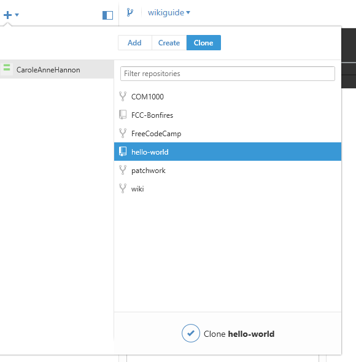
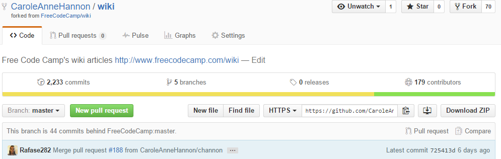
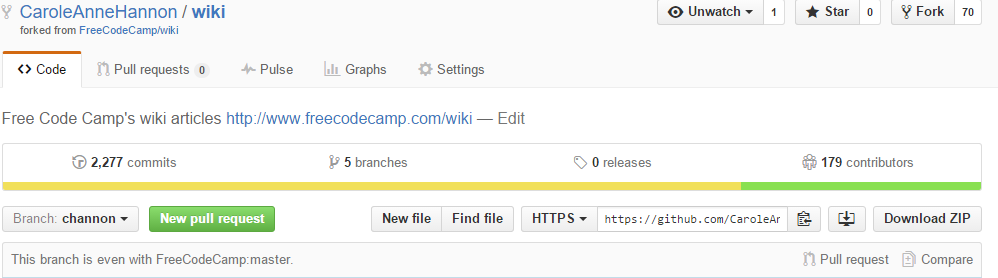

How To Contribute To The Wiki
============================

*This guide covers how to use GitHub Desktop as well as the Git command line*

*As such there might be 2 sets of directions. Pick what you need*

##Table of Contents
- [Initial: One Time Setups](#initial-one-time-setups)
	- [Cloning](#cloning)
- [Part 1: Choose what to work on](#part-1-choose-what-to-work-on)
- [Part 2: Rebasing your Master (or current branch)](#part-2-rebasing-your-master-or-current-branch)
	- [Doing a rebase](#doing-a-rebase)
- [Part 3: Making a new branch](#part-3-making-a-new-branch)
- [Part 4: Getting ready to edit](#part-4-getting-ready-to-edit)
- [Part 5: Commit to your branch](#part-5-commit-to-your-branch
- [Part 6: Pull Request to FCC Wiki Repo](#part-6-pull-request-to-fcc-wiki-repo)
- [Markdown Editing/Viewing Tools](#markdown-editing-viewing-tools)

## Initial: One Time Setups
 - Have a GitHub Account
 - Get Git on your computer
	 - [GitHub Desktop](https://desktop.github.com/). Also comes with Git Shell (a command line interface)
	 - Other Git clients like Git Bash
 - Go to the [Wiki Repo](https://github.com/FreeCodeCamp/wiki)
	- **CAREFUL:The Wiki is stored at a different repo than the main FCC site**
	- The above link is where you need to go
 - Click on **Fork** if you don't already have a Fork
	 - This will recreate the Wiki Repo under your username
	 - This will also automatically create the same branches that the FCC wiki Repo has. Thus you will now have a master **branch** as well.

|Vocabulary|Meaning|
|----------|-------|
|Repository| A data structure to manage a project or set of files and the changes it receives.|
|Repo| A shorter way to say Repository |
|Branch| A pointer to a version of a repo as of when the branch was last created/updated from that repo|
	 
### Cloning 
 *The following image is a reference to both sets of directions* 
 
 
#### Github Desktop Directions
 On ***your*** forked repository page, click the button that looks like a screen with an arrow. This will open GitHub Desktop to clone it automatically.
 
 If it doesn't do it automatically, you can:
 + Open GitHub Desktop yourself
 + click on the Arrow on the top
 + Select Clone
 + Pick the fork your wish to clone
 + Click on "Clone wiki"
 + Select where to clone it into
 
 
 
#### Command Line Directions
`git clone <GIT Repository URL>`

example: `git clone https://github.com/CaroleAnneHannon/wiki.git`

You can grab the repository URL on your fork. The image above shows a button that will copy it to your clipboard. 

|Vocabulary|Meaning|
|----------|-------|
|Fork|A repository made from another repository|
|Clone|A local instance made from a repository|

----------

----------
## Part 1: Choose what to work on ##
Feel free to look at the [issues](https://github.com/FreeCodeCamp/wiki/issues) on the Wiki's repo.

Additionally you can contact [@Rafase282](https://gitter.im/Rafase282) or ask in the [Wiki Chat](https://gitter.im/FreeCodeCamp/Wiki)

Lastly you could just make a change you feel is needed without coordinating with anyone - typo fixes for example.

## Part 2: Rebasing your Master (or current branch)
***Note*** : If you just made your brand new fork, you can skip this step.

However! 

That doesn't mean this isn't an important step. You should keep your master branch updated with the Wiki Repo's master branch so that if you make a new branch from it, you don't have to worry about merge issues.

You can see how your branch compares on GitHub:

### Doing a rebase
#### Command Line
***Viewing Remote Connections***

`git remote -v`

You will see *origin* which your repository

You will also most likely see *FreeCodeCamp* which should have the FreeCodeCamp/wiki.git connection. This is the original repo.
This command doesn't actually do anything other than show you what the connection names are, which is useful for the next few commands.

***Make a new branch if you need to***

`git branch <BRANCHNAME>`

example: `git branch wikiguide`

***Select your branch***

`git checkout <BRANCHNAME>`

example: `git checkout wikiguide`

***Making and selecting a branch in one step***

`git checkout -b <BRANCHNAME>`

example: `git checkout -b wikiguide`

*wikiguide is the branch this tutorial is using*

***Rebase***
`git rebase <REMOTENAME>/<REMOTEBRANCH>`
becomes:
`git rebase FreeCodeCamp/master`

***Push from the branch in github to your local machine***
`git push <REMOTENAME> <REMOTEBRANCH>`
becomes:
`git push origin wikiguide`

Now the branch should be up to date

#### GitHub Desktop

The Sync feature does not work well. Right click on the repo, open in Git Shell, and do the command line version as stated above.

|Vocabulary|Meaning|
|----------|-------|
|Rebase|the act of bringing down a branch to overwrite the current one|
|Push|writes the rebase to a branch|
|Commit|changes made to a repository|

## Part 3: Making a new branch
If you haven't already, you should make a new branch.

Branches should be named after what the change you are performing.

----------

----------

## Part 4: Getting ready to edit

Get to your directory on your local machine

*Github Desktop note*
You can right click and use "Open in Explorer"
Also if you cut your directory into another location, GitHub desktop will then no longer be able to find it and ask you the new location. This makes it very easy to move to a different location.

**Understanding how the wiki works**
All of the files for the wiki are .md files. These are **markdown** files. They use [markdown language](https://github.com/adam-p/markdown-here/wiki/Markdown-Cheatsheet) for the formatting of the files.

 - The Bonfire pages begin with Bonfire
 - The Waypoints pages begin with Waypoint
 - The JavaScript references pages begin with js
 - The Zipline pages begin with Zipline
 - The Basejump pages begin with Basejump
 - There are no spaces in the file names. use - instead
 - Files should be Title Cased (the first letter of each word should be capitalized)

Simply edit the file on your machine, or make a new one.

## Part 5: Commit to your branch
### GitHub Desktop Directions

----------

----------

## Part 6: Pull Request to FCC Wiki Repo

## Markdown Editing/Viewing Tools
